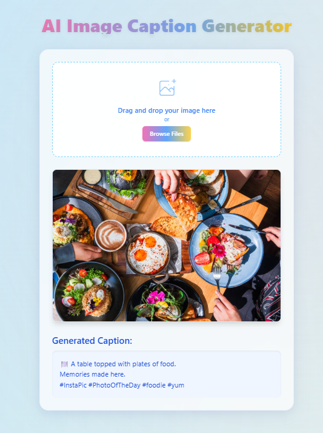

# 🖼️ AI Image Caption Generator 📷✨


A web app that uses a powerful AI model to generate captions for images you upload — enhanced with emojis and Instagram-friendly formatting!

---

## 🚀 Features

- 📤 Drag & Drop or click-to-upload image interface
- 🤖 AI-generated captions using ViT-GPT2 from Hugging Face
- 😀 Emojis based on detected objects
- 📱 Instagram-style captions with fun phrases and hashtags
- ⚡ Responsive, minimal, and fast

 ---

## 🧠 How It Works

1.The app uses a pretrained ViT-GPT2 model to generate descriptive captions from images.

2.Emojis are intelligently added based on keywords found in the caption.

3.Instagram-friendly formatting adds fun phrases and trending hashtags.

-----

## 📝 Example

**Input Image:** 🐶 dog on the beach

**Generated Caption:**

🐶 A dog playing on the beach.

Too good not to share!

#InstaGood #PhotoOfTheDay #beach #dog #dogsofinstagram #sunnydays

----

## 🧰 Tech Stack

- **Backend**: Python, Flask
- **AI Model**: `nlpconnect/vit-gpt2-image-captioning` (via Hugging Face Transformers)
- **Frontend**: HTML, CSS (Tailwind CSS), JavaScript
- **Image Processing**: Pillow

---

## 🛠️ Installation

### 🔗 Prerequisites
- Python 3.7+
- pip (Python package manager)

### 📥 Clone the Repository

```bash
git clone https://github.com/sonamnimje/image-caption-generator.git
cd image-caption-generator

```

2. Create a virtual environment (recommended):
```bash
python -m venv venv
venv\Scripts\activate  # Since you're on Windows
```

3. Install the required packages:
```bash
pip install -r requirements.txt
```

## Usage

1. Start the Flask application:
```bash
python app.py
```

2. Open your web browser and navigate to:
```
http://localhost:5000
```

3. Upload an image by either:
   - Dragging and dropping an image onto the drop zone
   - Clicking the drop zone and selecting an image from your file system

4. Wait for the AI to generate a caption for your image

## Technical Details

- Backend: Flask (Python)
- Frontend: HTML, CSS (Tailwind CSS), JavaScript
- AI Model: Hugging Face Transformers (Vision Encoder-Decoder)
- Image Processing: Pillow

## Note

The first time you run the application, it will download the pre-trained model which might take a few minutes depending on your internet connection. 

## 📸 Screenshot


